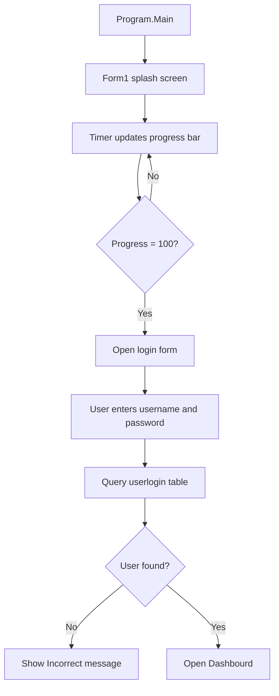
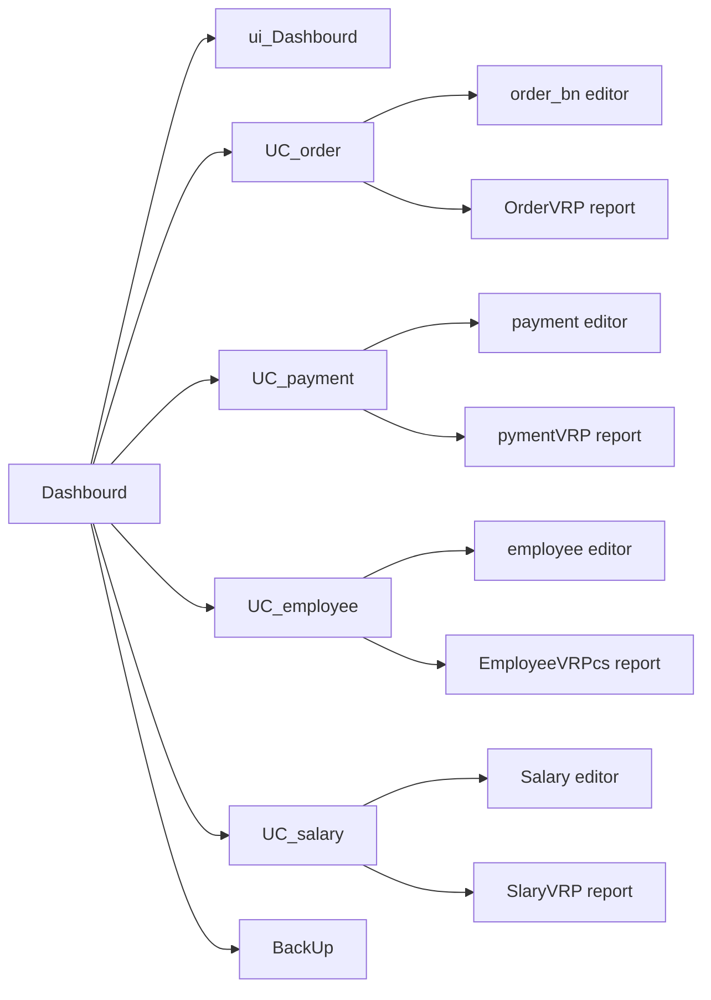
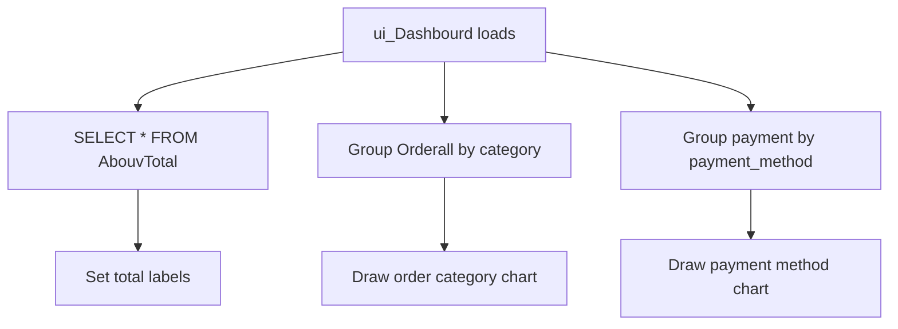
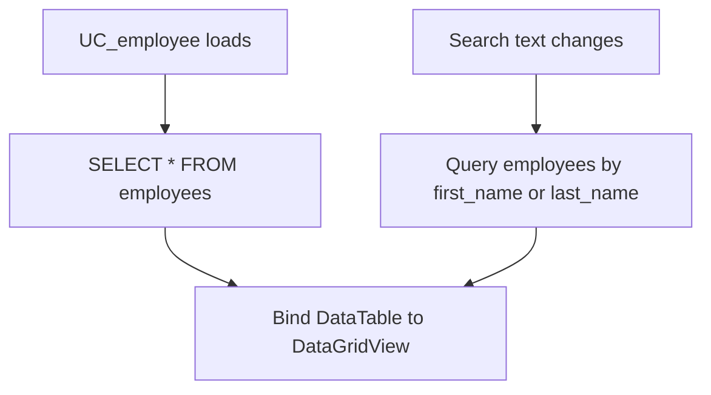
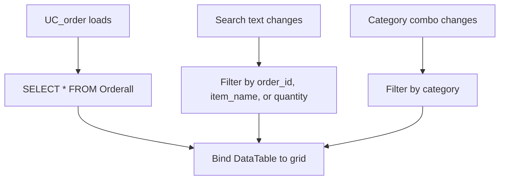
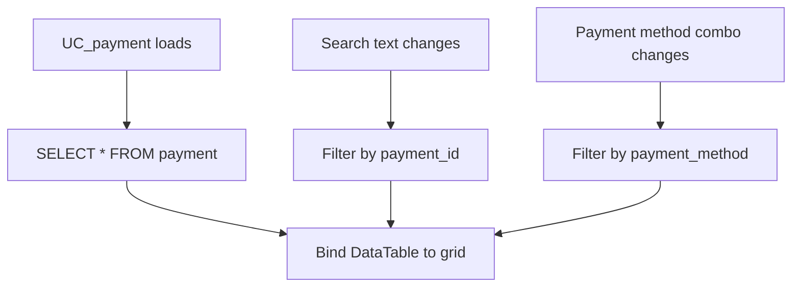
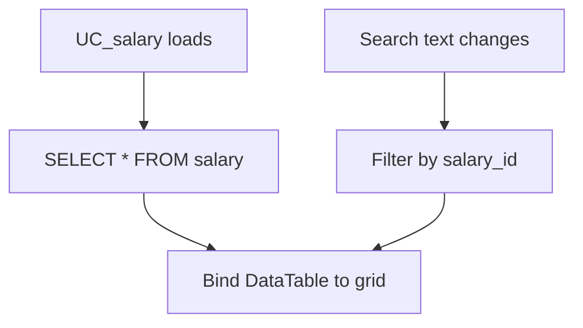
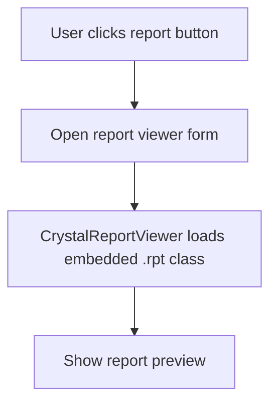
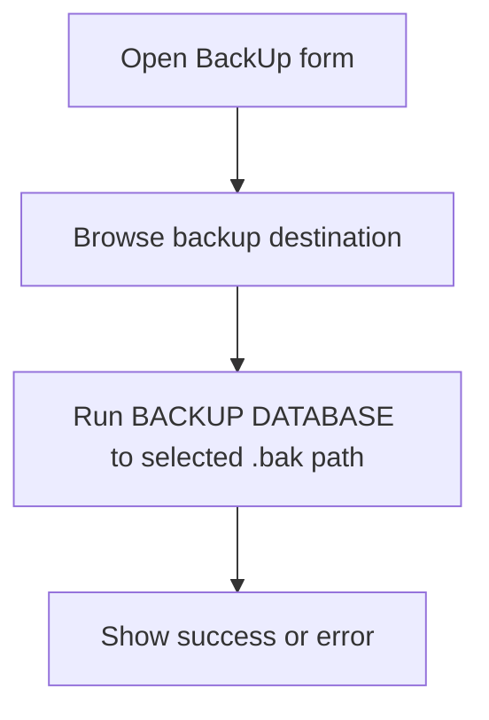
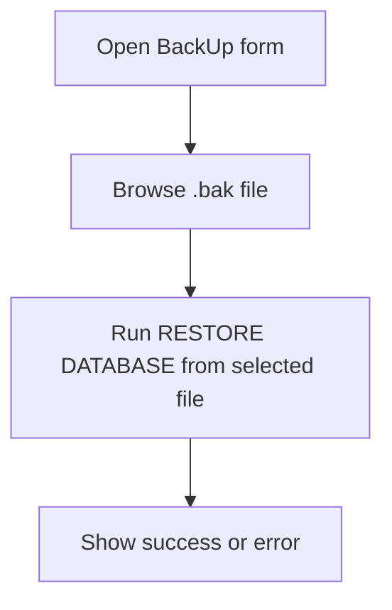

# Data Flow

This document describes how data moves through the Cafeteria Management System.

## Application Startup Flow



## Main Navigation Flow



## Authentication Data Flow

1. User enters `txtname` and `txtpass`.
2. `login.cs` runs:

```sql
Select * from userlogin where username=@user and password_hash=@pass
```

3. If a record exists, the dashboard opens.
4. If no record exists, the app shows `Incorrect`.

Forgot-password flow:

1. User enters username, email, and full name.
2. `forgot_pass.cs` checks the `userlogin` table.
3. If verification succeeds, the new password section is enabled.
4. If both password fields match, the app attempts to update `userlogin.password_hash`.

## Dashboard Data Flow



Dashboard queries:

```sql
SELECT * from AbouvTotal;

select distinct category, COUNT(*) as Totals
from Orderall
group by category;

select distinct payment_method, COUNT(*) as Totals
from payment
group by payment_method;
```

## Employee Data Flow

List and search:



Editor operations:

| Operation | SQL target |
| --- | --- |
| Save | `INSERT INTO employees` |
| Update | `UPDATE employees WHERE employee_id=@employee_id` |
| Delete | `DELETE FROM employees WHERE employee_id=@employee_id` |
| Search | `SELECT * FROM employees WHERE employee_id=@employee_id` |

## Order Data Flow

List and filters:



Editor operations:

| Operation | SQL target |
| --- | --- |
| Save | `INSERT INTO Orderall` |
| Update | `UPDATE Orderall WHERE order_id=@order_id` |
| Delete | `DELETE FROM Orderall WHERE order_id=@order_id` |
| Search | `SELECT * FROM Orderall WHERE order_id=@order_id` |

## Payment Data Flow

List and filters:



Editor operations:

| Operation | SQL target |
| --- | --- |
| Save | `INSERT INTO payment` |
| Update | `UPDATE payment WHERE payment_id=@payment_id` |
| Delete | `DELETE FROM payment WHERE payment_id=@payment_id` |
| Search | `SELECT * FROM payment WHERE payment_id=@payment_id` |

## Salary Data Flow

List and search:



Editor operations:

| Operation | SQL target |
| --- | --- |
| Save | `INSERT INTO Salary` |
| Update | `UPDATE Salary WHERE salary_id=@salary_id` |
| Delete | `DELETE FROM Salary WHERE salary_id=@salary_id` |
| Search | `SELECT * FROM Salary WHERE salary_id=@salary_id` |

## Report Flow



Report viewers:

| Module | Viewer form | Report class/file |
| --- | --- | --- |
| Employees | `EmployeeVRPcs` | `EmployeeRP.rpt` |
| Orders | `OrderVRP` | `OrderRT.rpt` |
| Payments | `pymentVRP` | `pymentRP.rpt` |
| Salary | `SlaryVRP` | `SalaryRP.rpt` |

## Backup And Restore Flow

Backup:



Restore:


