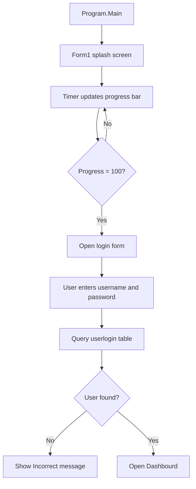
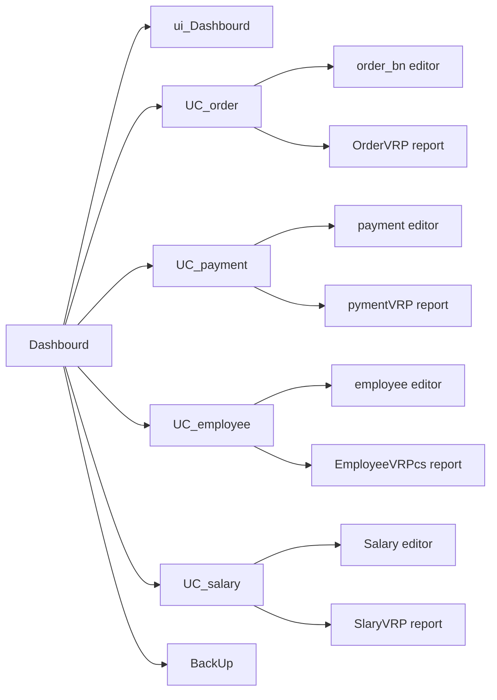
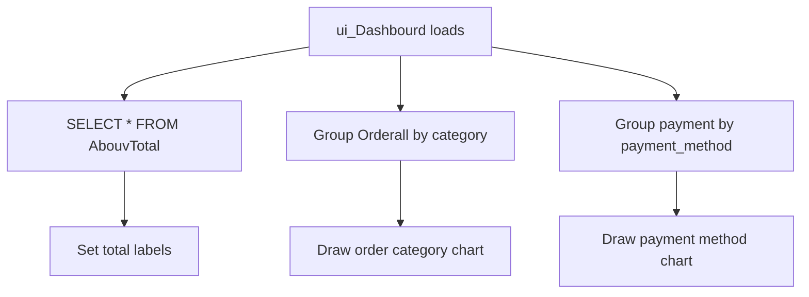
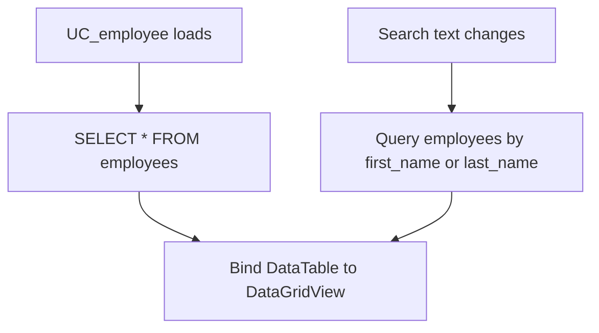
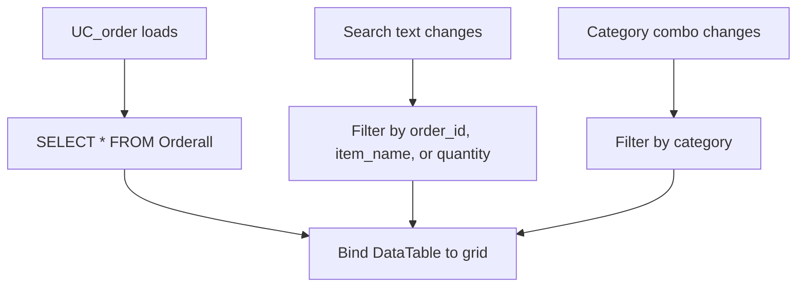
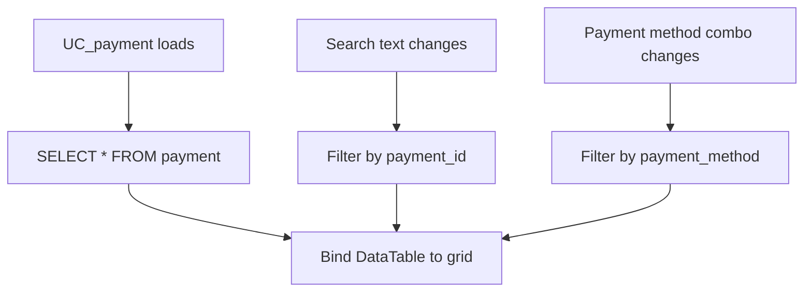
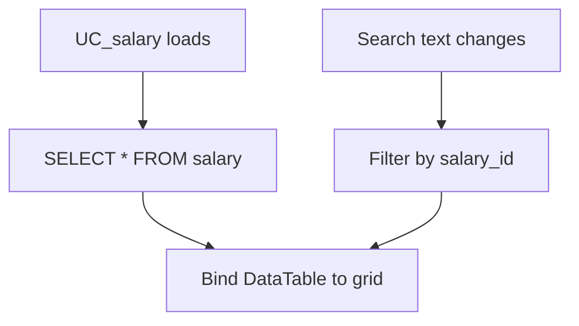
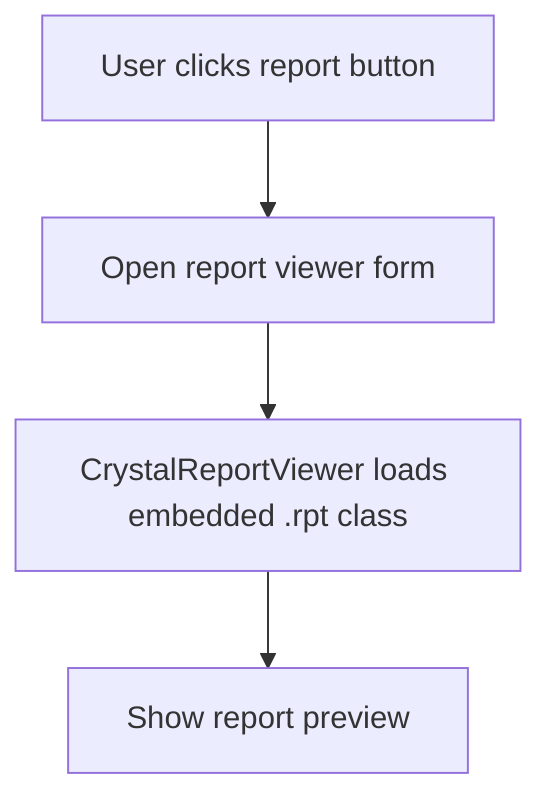
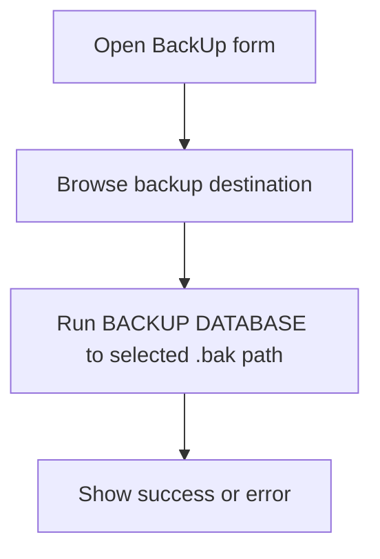
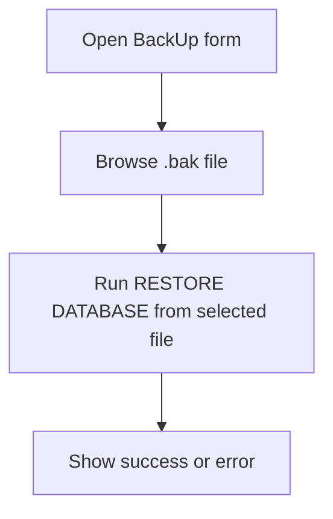

# Data Flow

<style>
.flow-wrap{font-family:Segoe UI,Arial,sans-serif}.flow-hero{display:grid;grid-template-columns:1.1fr .9fr;gap:24px;align-items:center;margin:24px 0;padding:28px;border-radius:26px;background:linear-gradient(135deg,#14532d,#16a34a 50%,#06b6d4);box-shadow:0 24px 55px rgba(22,163,74,.25);overflow:hidden;animation:flowFade .8s ease both}.flow-hero h2{margin:12px 0 10px;color:#fff;font-size:34px;line-height:1.05}.flow-hero p{color:#dcfce7;font-size:16px;line-height:1.65}.flow-tag{display:inline-block;margin:4px 6px 4px 0;padding:7px 12px;border-radius:999px;background:rgba(255,255,255,.16);color:#fff;border:1px solid rgba(255,255,255,.25);font-size:12px;font-weight:800}.flow-hero img{width:100%;height:245px;object-fit:cover;border-radius:20px;box-shadow:0 18px 40px rgba(0,0,0,.28);animation:flowFloat 5s ease-in-out infinite}.flow-track{display:grid;grid-template-columns:repeat(auto-fit,minmax(135px,1fr));gap:12px;margin:22px 0}.flow-step{padding:16px;border-radius:18px;background:#fff;border:1px solid #bbf7d0;box-shadow:0 16px 35px rgba(2,8,23,.09);text-align:center;animation:flowPulse 2.3s ease-in-out infinite}.flow-step:nth-child(2){animation-delay:.2s}.flow-step:nth-child(3){animation-delay:.4s}.flow-step:nth-child(4){animation-delay:.6s}.flow-step:nth-child(5){animation-delay:.8s}.flow-step b{display:block;color:#14532d;font-size:18px}.flow-step span{display:block;margin-top:6px;color:#475569;font-size:13px}.flow-photo-row{display:grid;grid-template-columns:repeat(auto-fit,minmax(190px,1fr));gap:12px;margin:22px 0}.flow-photo{overflow:hidden;border-radius:20px;box-shadow:0 18px 40px rgba(15,23,42,.16)}.flow-photo img{width:100%;height:150px;object-fit:cover;display:block;transition:.3s}.flow-photo:hover img{transform:scale(1.06)}@keyframes flowFade{from{opacity:0;transform:translateY(18px)}to{opacity:1;transform:translateY(0)}}@keyframes flowFloat{0%,100%{transform:translateY(0)}50%{transform:translateY(-9px)}}@keyframes flowPulse{0%,100%{transform:scale(1)}50%{transform:scale(1.035)}}@media(max-width:760px){.flow-hero{grid-template-columns:1fr;padding:20px}.flow-hero h2{font-size:26px}}
</style>
<link rel="stylesheet" href="https://unpkg.com/aos@2.3.1/dist/aos.css">
<script src="https://cdn.tailwindcss.com"></script>
<script src="https://unpkg.com/aos@2.3.1/dist/aos.js"></script>
<script>
document.addEventListener("DOMContentLoaded",function(){document.querySelectorAll(".flow-step,.flow-photo").forEach(function(el,i){el.setAttribute("data-aos","fade-right");el.style.animationDelay=(i*80)+"ms"});if(window.AOS){AOS.init({duration:850,once:true,easing:"ease-out-cubic"})}});
</script>

<div class="flow-wrap">
  <div class="flow-hero">
    <div>
      <span class="flow-tag">UI Event</span><span class="flow-tag">SQL Query</span><span class="flow-tag">Grid Update</span>
      <h2>Animated Data Flow</h2>
      <p>Every module follows the same rhythm: open a section, load a grid from SQL Server, filter or search records, then use a popup form to create, update, delete, or report on the data.</p>
    </div>
    
  </div>

  <div class="flow-track">
    <div class="flow-step"><b>1</b><span>Splash timer</span></div>
    <div class="flow-step"><b>2</b><span>Login query</span></div>
    <div class="flow-step"><b>3</b><span>Dashboard totals</span></div>
    <div class="flow-step"><b>4</b><span>CRUD forms</span></div>
    <div class="flow-step"><b>5</b><span>Reports/backup</span></div>
  </div>

  <div class="flow-photo-row">
    <div class="flow-photo"></div>
    <div class="flow-photo"></div>
    <div class="flow-photo"></div>
  </div>
</div>

This document describes how data moves through the Cafeteria Management System.

## Application Startup Flow



## Main Navigation Flow



## Authentication Data Flow

1. User enters `txtname` and `txtpass`.
2. `login.cs` runs:

```sql
Select * from userlogin where username=@user and password_hash=@pass
```

3. If a record exists, the dashboard opens.
4. If no record exists, the app shows `Incorrect`.

Forgot-password flow:

1. User enters username, email, and full name.
2. `forgot_pass.cs` checks the `userlogin` table.
3. If verification succeeds, the new password section is enabled.
4. If both password fields match, the app attempts to update `userlogin.password_hash`.

## Dashboard Data Flow



Dashboard queries:

```sql
SELECT * from AbouvTotal;

select distinct category, COUNT(*) as Totals
from Orderall
group by category;

select distinct payment_method, COUNT(*) as Totals
from payment
group by payment_method;
```

## Employee Data Flow

List and search:



Editor operations:

| Operation | SQL target |
| --- | --- |
| Save | `INSERT INTO employees` |
| Update | `UPDATE employees WHERE employee_id=@employee_id` |
| Delete | `DELETE FROM employees WHERE employee_id=@employee_id` |
| Search | `SELECT * FROM employees WHERE employee_id=@employee_id` |

## Order Data Flow

List and filters:



Editor operations:

| Operation | SQL target |
| --- | --- |
| Save | `INSERT INTO Orderall` |
| Update | `UPDATE Orderall WHERE order_id=@order_id` |
| Delete | `DELETE FROM Orderall WHERE order_id=@order_id` |
| Search | `SELECT * FROM Orderall WHERE order_id=@order_id` |

## Payment Data Flow

List and filters:



Editor operations:

| Operation | SQL target |
| --- | --- |
| Save | `INSERT INTO payment` |
| Update | `UPDATE payment WHERE payment_id=@payment_id` |
| Delete | `DELETE FROM payment WHERE payment_id=@payment_id` |
| Search | `SELECT * FROM payment WHERE payment_id=@payment_id` |

## Salary Data Flow

List and search:



Editor operations:

| Operation | SQL target |
| --- | --- |
| Save | `INSERT INTO Salary` |
| Update | `UPDATE Salary WHERE salary_id=@salary_id` |
| Delete | `DELETE FROM Salary WHERE salary_id=@salary_id` |
| Search | `SELECT * FROM Salary WHERE salary_id=@salary_id` |

## Report Flow



Report viewers:

| Module | Viewer form | Report class/file |
| --- | --- | --- |
| Employees | `EmployeeVRPcs` | `EmployeeRP.rpt` |
| Orders | `OrderVRP` | `OrderRT.rpt` |
| Payments | `pymentVRP` | `pymentRP.rpt` |
| Salary | `SlaryVRP` | `SalaryRP.rpt` |

## Backup And Restore Flow

Backup:



Restore:


