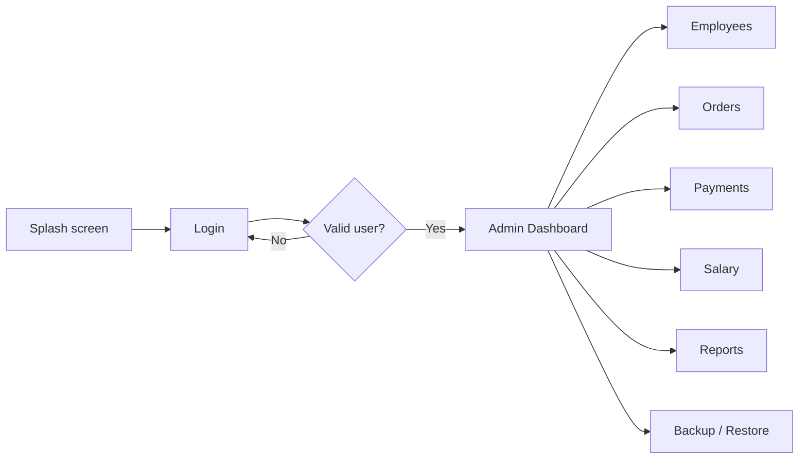

# Cafeteria Management System

<p align="center">
  
</p>

<p align="center">
  
  
  
  
</p>

<p align="center">
  A C# Windows Forms desktop application for managing cafeteria employees, orders, payments, salary records, reports, and database backup/restore.
</p>

> GitHub note: GitHub README files do not run custom CSS, JavaScript, Tailwind CDN, or animation libraries for security. Visuals here use GitHub-supported Markdown, HTML tables, badges, images, and GIFs.

## Visual Overview

| Login / Access | Dashboard | Database / Flow |
| --- | --- | --- |
|  |  |  |
| Animated login asset from the project. | Dashboard/home visual from the project resources. | Database schema concept from the `state` folder. |

## Main Modules

| Employees | Orders | Payments | Salary |
| --- | --- | --- | --- |
| <br>Manage staff records, search employees, and open employee reports. | <br>Create, update, delete, search, and filter cafeteria orders. | <br>Track payment amount, method, date, and status. | <br>Manage salary month, bonuses, deductions, and salary reports. |

## What The App Does

- Starts with a splash/loading screen.
- Opens a login form and checks users in the `userlogin` table.
- Provides a forgot-password workflow.
- Opens an admin dashboard after successful login.
- Shows dashboard totals and charts for orders and payments.
- Manages employees, orders, payments, and salaries.
- Opens Crystal Reports for employees, orders, payments, and salaries.
- Backs up and restores the SQL Server database using `.bak` files.

## Application Flow



## Screens And Source Files

| Screen/File | Purpose |
| --- | --- |
| `Form1` | Splash/loading form. After the progress bar reaches 100, opens `login`. |
| `login` | Authenticates against `userlogin.username` and `userlogin.password_hash`. |
| `forgot_pass` | Verifies username/email/full name, then attempts password reset. |
| `Dashbourd` | Main admin shell with side navigation. |
| `ui_Dashbourd` | Dashboard totals and charts. |
| `UC_employee` | Employee list, search, refresh, editor, and report entry. |
| `employee` | Employee create/update/delete/search form. |
| `UC_order` | Order list, search, refresh, category filter, editor, and report entry. |
| `order_bn` | Order create/update/delete/search form. |
| `UC_payment` | Payment list, search, refresh, method filter, editor, and report entry. |
| `payment` | Payment create/update/delete/search form. |
| `UC_salary` | Salary list, search, refresh, editor, and report entry. |
| `Salary` | Salary create/update/delete/search form. |
| `BackUp` | Backup and restore database `.bak` files. |

## Technology Stack

| Area | Technology |
| --- | --- |
| Language | C# |
| App type | Windows Forms desktop application |
| Framework | .NET Framework 4.7.2 |
| Database | SQL Server LocalDB |
| Data access | `System.Data.SqlClient` |
| Reports | Crystal Reports |
| UI libraries | Bunifu UI WinForms, Guna.UI2 WinForms |
| Charts | Windows Forms chart controls |

## Database

The application uses SQL Server LocalDB with this configured database:

```text
(localdb)\ProjectModels
Cafeteria_management_C_DB
```

Required tables:

- `userlogin`
- `employees`
- `Orderall`
- `payment`
- `salary`

Required dashboard object:

- `AbouvTotal`

`AbouvTotal` is used by the dashboard totals screen. It should return totals in this order: orders, salary, employees, payments.

More detail is in [Database.md](Database.md).

## Reports

| Report | Viewer Form |
| --- | --- |
| `EmployeeRP.rpt` | `EmployeeVRPcs` |
| `OrderRT.rpt` | `OrderVRP` |
| `pymentRP.rpt` | `pymentVRP` |
| `SalaryRP.rpt` | `SlaryVRP` |

## Project Structure

```text
SS_Assment_Cafateria_C#.sln
SS_Assment_Cafateria_C#/
  App.config
  Program.cs
  Form1.cs
  login.cs
  forgot_pass.cs
  Dashbourd.cs
  ui_Dashbourd.cs
  UC_employee.cs
  employee.cs
  UC_order.cs
  order_bn.cs
  UC_payment.cs
  payment.cs
  UC_salary.cs
  Salary.cs
  BackUp.cs
  Cafeteria_management_C_DBDataSet.xsd
  *.rpt
  Resources/
state/
  ChatGPT Image May 27, 2026, 11_44_28 PM.png
  ChatGPT Image May 28, 2026, 12_01_30 AM.png
  SL-100820-36440-01.jpg
  images.jpeg
  images (1).jpeg
  images.png
```

## Build And Run

1. Install Visual Studio with .NET Framework desktop development.
2. Install .NET Framework 4.7.2 targeting pack if required.
3. Install SQL Server LocalDB.
4. Install Crystal Reports runtime/developer components for .NET Framework.
5. Make sure Bunifu UI and Guna.UI2 assemblies are available.
6. Create the `Cafeteria_management_C_DB` database using [Database.md](Database.md).
7. Add at least one row to `userlogin`.
8. Open `SS_Assment_Cafateria_C#.sln` in Visual Studio.
9. Build and run the project.

## Important Notes

- The current login compares the password text directly to `userlogin.password_hash`.
- The forgot-password code references `fullname`, while the typed dataset defines `full_name`.
- The password reset update statement references `Users`, which may need database/code alignment.
- Some search filters build SQL using string concatenation.
- `salary.salary_month` is defined as text in the typed dataset, while the form uses a date picker.
- `Orderall.subtotal` is read-only in the typed dataset and should be handled as a computed column.

## More Documentation

- [Database.md](Database.md) - database schema, relationships, and setup SQL.
- [DATA_FLOW.md](DATA_FLOW.md) - application and data flow.
- [USE_CASES.md](USE_CASES.md) - use cases by actor/workflow.
- [SYSTEM_USAGE.md](SYSTEM_USAGE.md) - how an operator uses the system.
