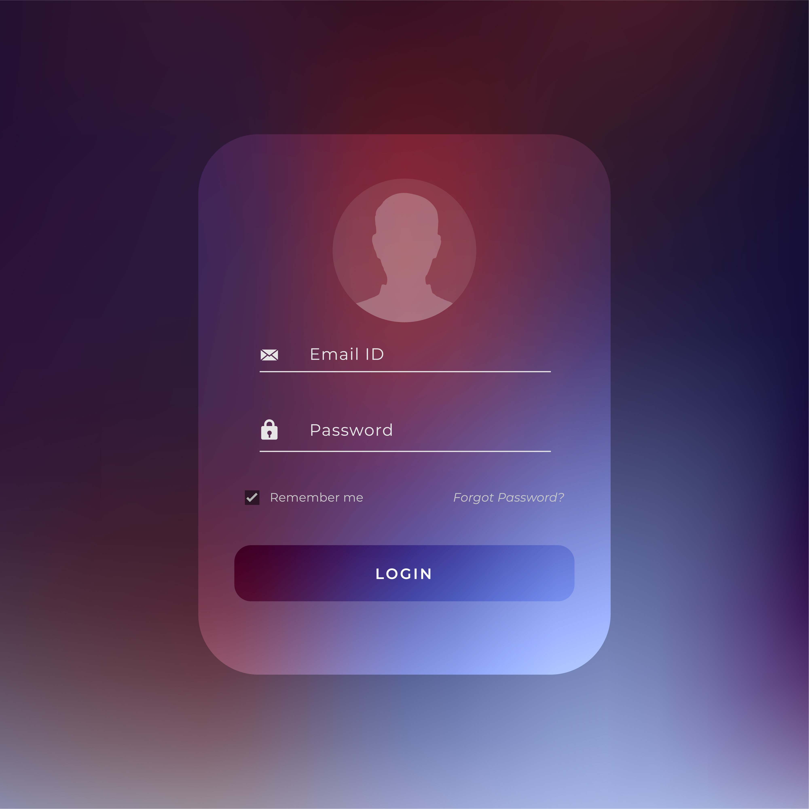

# System Usage Guide

<link rel="stylesheet" href="https://unpkg.com/aos@2.3.1/dist/aos.css">

  

    

      Step-by-stepOperator GuideReports
      <h2>How To Use The System</h2>
      
Use the dashboard menu as the control center: log in, choose a module, work with records, print reports, and protect the database with backups.

      

Login

Open Module

Save/Search

Report

    

    
  

  

    
<h3>Login</h3>
Enter credentials.

    
<h3>Dashboard</h3>
Open a section.

    
<h3>Create</h3>
Add records.

    
<h3>Refresh</h3>
Reload grids.

    
<h3>Report</h3>
Preview reports.

  

This guide explains how to use the Cafeteria Management System from the user interface.

## Before First Use

1. Create the SQL Server database described in [Database.md](Database.md).
2. Add at least one row to `dbo.userlogin`.
3. Make sure the app can connect to `(localdb)\ProjectModels`.
4. Build and run the Windows Forms project.

## Login

1. Start the app.
2. Wait for the loading screen to finish.
3. Enter the username.
4. Enter the password.
5. Optional: check `Show` to reveal the password field.
6. Click `Login`.

If login succeeds, the dashboard opens. If login fails, the app shows `Incorrect`.

## Forgot Password

1. On the login screen, click `Forgot password ?`.
2. Enter username, email, and full name.
3. Click `Check`.
4. If verified, enter a new password and confirmation password.
5. Click `Change`.

Note: the current code has database naming inconsistencies in this workflow. See [Database.md](Database.md).

## Dashboard

Use the left menu to open each section:

- `Dashbourd` for totals and charts.
- `Order` for order list, filters, editor, and order report.
- `Payment` for payment list, filters, editor, and payment report.
- `Employees` for employee list, search, editor, and employee report.
- `Salary` for salary list, search, editor, and salary report.
- `BackUp` for backup and restore.
- `Logout` to return to the login screen.

## Employees

To view employees:

1. Click `Employees`.
2. The grid loads all `employees` records.
3. Type in the search box to filter by first name or last name.
4. Click refresh to reload the full list.

To add an employee:

1. Click the employee editor button.
2. Enter user login id, first name, last name, position, hire date, email, phone, hourly rate, and monthly salary.
3. Click `Save`.

To update an employee:

1. Enter the employee id.
2. Click `Search`.
3. Change the values.
4. Click `Update`.

To delete an employee:

1. Enter the employee id.
2. Click `Delete`.

To print/view report:

1. Click the report button.
2. The Crystal Report viewer opens.

## Orders

To view orders:

1. Click `Order`.
2. The grid loads all `Orderall` records.
3. Type in the search box to filter by order id, item name, or quantity.
4. Use the category dropdown to filter by `Drink` or `Food`.
5. Click refresh to reload the full list.

To add an order:

1. Click the order editor button.
2. Enter employee id, order date, notes, item name, category, item price, quantity, unit price, and total amount.
3. Click `Save`.

To update an order:

1. Enter the order id.
2. Click `Search`.
3. Change the values.
4. Click `Update`.

To delete an order:

1. Enter the order id.
2. Click `Delete`.

To print/view report:

1. Click the report button.
2. The Crystal Report viewer opens.

## Payments

To view payments:

1. Click `Payment`.
2. The grid loads all `payment` records.
3. Type in the search box to filter by payment id.
4. Use the method dropdown to filter by `cash`, `card`, or `mobile`.
5. Click refresh to reload the full list.

To add a payment:

1. Click the payment editor button.
2. Enter order id, amount, payment method, payment date, and status.
3. Optionally leave payment id blank so the database identity can generate it.
4. Click `Save`.

To update a payment:

1. Enter the payment id.
2. Click `Search`.
3. Change the values.
4. Click `Update`.

To delete a payment:

1. Enter the payment id.
2. Click `Delete`.

To print/view report:

1. Click the report button.
2. The Crystal Report viewer opens.

## Salary

To view salaries:

1. Click `Salary`.
2. The grid loads all `salary` records.
3. Type in the search box to filter by salary id.
4. Click refresh to reload the full list.

To add a salary record:

1. Click the salary editor button.
2. Enter employee id, salary month, base salary, bonuses, deductions, payment date, and notes.
3. Click `Save`.

To update a salary record:

1. Enter the salary id.
2. Click `Search`.
3. Change the values.
4. Click `Update`.

To delete a salary record:

1. Enter the salary id.
2. Click `Delete`.

To print/view report:

1. Click the report button.
2. The Crystal Report viewer opens.

## Backup

To create a database backup:

1. Click `BackUp`.
2. Click `Browse` beside the backup path.
3. Choose a `.bak` file path.
4. Click `Backup`.

To restore a database backup:

1. Click `BackUp`.
2. Browse for a `.bak` backup file.
3. Click `Restore`.

The SQL Server process must have access to the selected file path.
